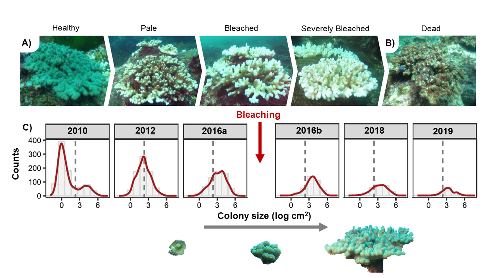

<!-- README.md is generated from README.Rmd. Please edit that file -->

# SizeExtractR

<!-- badges: start -->

<!-- badges: end -->

#### Goal

The goal of SizeExtractR is to facilitate scientific projects that have
research questions relating to size, from pure biology to ecology on
individual to landscape scales, by providing a user-friendly interactive
set of R tools and ImageJ image analysis tools and protocol.

> Uses like demographics, population dynamics, and size as a proxy of
> energy investment.

#### Image Analysis

The ImageJ tools and protocol serve to optimise the slow task of
manually outlining objects from sets of images. A scale is required
within each image. These tools can save considerable time, and are a
great option for image analysis applications that are not suited to
machine-learning or other automated outlining classifiers.

#### R package

The R tools are used to synthesis all data into one master dataset, with
all variables of interest included. Additional problem-solving tools are
also provided.

#### Size Metrics

Measures of size that are captured using SizeExtractR tools include:

  - area
  - minimum and maximum diameter
  - estimated spherical and elliptical volume
  - bounding boxes

#### Other Metrics

Users can also record additional variables of interest using a simple
labeling system. For instance, the tools were developed on a coral
bleaching demography data set, so coral species, bleaching status,
partial mortality, and parasitism were all recorded as categorical image
label codes.

## Example

This is the output from a [Lachs et
al. (2021)](https://doi.org/10.1007/s00338-021-02081-2) that used an
earlier version of SizeExtractR to assess coral demography and
population dynamics before and after mass bleaching in 2016.

Coral Population Size Structure:

