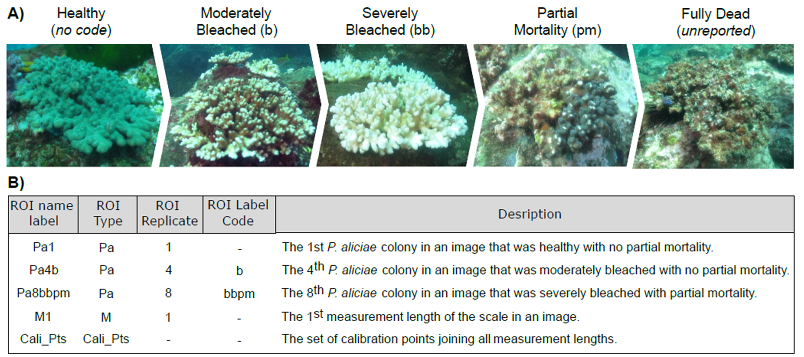

```{r, include = FALSE}
knitr::opts_chunk$set(
  collapse = TRUE,
  comment = "#>"
)
```
Liam Lachs  

# ____________________
# Overview of workflow
SizeExtractR is a semi-automated workflow designed to improve the speed, reliability, and reproducibility of extracting size metrics from objects within images. On the spectrum of image analysis techniques that range from fully manual to fully automated, SizeExtractR lies in the middle. Note that a full User Guide is available at the [data repository](https://doi.org/10.25405/data.ncl.15106455) (it is currently only accessible at the [private link](https://figshare.com/s/f243f91b8ba2ab405156), but will be transferred to the doi link upon publication).
Broadly there are three steps to using SizeExtractR.

## A) Prep work
First the set of images to be analysed must be organised within a nested directory where the naming of folders is consistent. For example, for a field survey, there would be one root directory, year folders are stored here, with site folders within each year folder. The directory structure and folder names will be used later to determine the categorical variables that relate to each image (e.g., which year and site is the image from?).

## B) SizeExtractR ImageJ analysis
The next stage of the SizeExtractR workflow is completed in ImageJ software using SizeExtractR macros to speed up an otherwise labour-intensive process of outlining Regions of Interest (ROIs), annotating/naming each ROI, measuring calibration lengths (e.g., ruler in each image), and then saving the data. The SizeExtractR worklfow exports one data file (.txt) per image that contains the uncalibrated size data (in pixels) and alphanumeric annotations (ROI label name, manually input by the user) for each ROI in that image. The following size metrics are computed:
1. Area
2. Circular equivalent diameter
3. Extruded spherical volume
4. Perimeter length
5. Maximum caliper diameter
6. Minimum caliper diameter
7. Geometric mean diameter


## C) SizeExtractR R-package
Finally, the SizeExtractR R-package is used to perform quality control on ROI annotations, collate all the individual data files across an analysed image set, calibrate size metrics, and produce a single size dataset to be used for other scientific purposes. Overall, the R-package conducts the following interactive steps to build the size dataset:
1. Quality control on the directory structure and folder names
2. Set *Directory Variable* names to be used in the final dataset
3. Quality control on the first section of ROI name labels (*ROI Type*)
4. Set *ROI Variable* names for final dataset (based on *ROI Label Codes*)
5. Quality control on the last section of ROI name labels (*ROI Label Code*)
6. Calibrate the size metrics
7. Plotting size distributions by group


# ______________
# Worked example
To help users to learn the full SizeExtractR protocol (organising files, ImageJ, and R-package), a full worked example is provided in the official SizeExtractR User Guide. Here, we assume the user has already completed the steps in ImageJ and is ready to collate their data into a single dataset. Here is an example of an annotated image

## A) Case Study background
This worked example based on a subset of data from [Lachs et al. (2021)](https://doi.org/10.1007/s00338-021-02081-2). This database contains images of the seabed, each including a measurement scale. The images were taken during and 6-months after a coral bleaching event in 2016 in the Solitary Islands Marine Park, Southeast Australia. The research goal here was to assess how population size structure of the coral *Pocillopora aliciae* differs before and after coral bleaching event. 

## B) Labelling system
As all ROIs in this study are *P. aliciae* corals, all have an **_ROI Type_** code of *Pa*. The **_ROI Label Codes_** are shown in Table 1.

**Table 1.** Table of the **ROI Label Codes** for this worked example, along with corresponding variable names which will be in the final dataset.
```{r, echo=FALSE, warning=FALSE}
library(knitr)
library(kableExtra)
knitr::kable(data.frame(ROI_Label_code = c("b","bb","pm"),                    
                        Corresponding_Variable_Name = c("Mod_Bleached","Sev_Bleached","Partial_Mortality")),
             align="c") %>%
  kableExtra::kable_styling()
```

## C) Example images
Examples of the study organism and table of the annotations used during image analysis are shown in  Fig. 1, and an example analysed image (from ImageJ) is shown in Fig. 2.


{width=100%}

**Figure 1.** Overview of annotations used in this study. Using SizeExtractR to assess population size structure for hard coral from scaled seafloor photographs of the benthos ([Lachs et al., 2021](https://doi.org/10.1007/s00338-021-02081-2); [Sommer et al., 2014](https://doi.org/10.1890/13-1445.1)). A) The process of coral bleaching from a healthy state until mortality is shown for Pocillopora aliciae. The user-defined ROI Label Code for recording the different categories are shown in backets. Moderately and severely bleached colonies are recorded as ‘*b*’ and ‘*bb*’, respectively, and partial mortality is recorded as ‘*pm*’. No ROI Label Code denoted a healthy colony, and dead colonies were not analysed. B) Example ROI name labels are shown with descriptions, including the automatically produced codes for calibration lengths (*M*) and calibration points (*Cali_Pts*).

{width=100%}

**Figure 2.** Example image output from ImageJ using the SizeExtractR ImageJ macros and workflow. Note the measurement stick is chunked into 10cm lengths which are annotated as *Cali_Pts* and *M1*-*M4*. Note the alphanumeric annotations used on the corals, and link them to Fig. 1 to understand the labelling system (*Pa*, *b*, *bb*). Note there are no corals in this image that suffer from partial mortality (*pm*)

## D) Aim and Accessing datasets
The aim of this vignetter is to complete quality control of annotations build a single calibrated size dataset based on an entire set of images analysed using the SizeExtractR ImageJ macros and workflow Follow the steps below to learn how! The ImageJ-analysed dataset is saved in two versions.
* The full folder with images and size data text files can be found in the [data repository](https://doi.org/10.25405/data.ncl.15106455) (currently accessible at the [private link](https://figshare.com/s/f243f91b8ba2ab405156), but will be transferred to the doi link upon publication) as a folder named *Coral_Example_b_processed_post-ImageJ*. 
* A reduced dataset containing only the directory structure and text files (no images to save space) is saved on the [SizeExtract github page](https://github.com/liamlachs/SizeExtractR/tree/master/inst).


# __________________
# Step-by-step Guide
## A) Setup
* Open R
* Install SizeExtractR  
Do this only if the package is not yet installed.
```
library(devtools)
devtools::install_github("liamlachs/SizeExtractR")
```
* Load SizeExtractR
```{r setup}
library(SizeExtractR)
```


## B) Save Path
Save a variable with the path string to the root directory folder containing the image analysis files.
```{r}
mypath = "Coral_Example_b_processed_post-ImageJ"
```

## C)	Run `Full_SizeExtractR_Workflow()`
Note that the `known.calibration.length` parameter is entered as a value 10 (cm), as that was length of each calibration length on the measurement stick. Therefore all computed size metrics will be in centimeters. The `include.calibrations` parameter is set to `FALSE` to avoid measurement stick lengths (e.g., *Cali_Pts* and *M1*-*M4*) being included in the final dataset.
```
data = SizeExtractR::Full_SizeExtractR_Workflow(
  mypath,
  known.calibration.length = 10,
  include.calibrations = FALSE)
```


## D) Step-by-step for `Full_SizeExtractR_Workflow()`
Everything this function does is described in the following steps, and will colminate in a full calibrated size dataset. **However**, note that if there are mistakes that are found during quality control, then you will need to make changes outside R manually, and then rerun `Full_SizeExtractR_Workflow()`.  
**Note:** For each following step there is a screen shot of the R console after running `Full_SizeExtractR_Workflow()`. **Please read the red text** which is a guide for navigating the interactive quality control checks and variable setting.  

1. **Quality control - _Directory Variables_**  
    Ensures the folder names are all correct. If any names are incorrect, rename the folders manually outside of the R environment, and rerun `Full_SizeExtractR_Workflow()`.  
      
    {width=75%}  
    
    
2. **Set _Directory Variable_ names**  
    The second step is to fill in the Variable names for each directory level. Here we have entered *Timepoint* and *Site*, which will end up as two categorical variables (columns) in the final dataset.  
      
    {width=75%}
    

3. **Quality control - _ROI Type_ codes**  
    Ensures there are no human errors (e.g., typos) in the annotated **ROI Type** codes (c.f. Figure 1). If errors are present choose `no` and then you will be given an option to locate the specific images that contain errors. Then you would need to rerun the workflow function.  
    If there are no errors then proceed.  
      
    {width=75%}
    

4. **Set _ROI Variable_ names**  
    Now we must link the user-defined ROI Label Codes to corresponding names of categorical ROI Variables for the final dataset. This information must be added manually to the **ROI_Labels.csv** template file outside the R environment. This template file will have been automatically created. For this worked example, we will fill the data from Table 1 into the .csv file manually, save it, then continue in R.  
    Please do this now.  
    **Table 1.** Repeated from above
```{r, echo=FALSE, warning=FALSE}
library(knitr)
library(kableExtra)
knitr::kable(data.frame(ROI_Label_code = c("b","bb","pm"),                    
                        Corresponding_Variable_Name = c("Mod_Bleached","Sev_Bleached","Partial_Mortality")),
             align="c") %>%
  kableExtra::kable_styling()
```
      
    {width=75%}
    
    
5. **Quality control - _ROI Label Codes_ 1**  
    Ensures there are no human errors (e.g., typos) in the annotated **ROI Label Codes** (c.f. Fig. 1). Check that the data entered into the .csv file is correct.  
      
    {width=75%}

    
6. **Quality control - _ROI Label Codes_ 2**  
    Finally, check that the translation matrix from *ROI Label Codes* to *ROI Variables* is correct.  
      
    {width=75%}
    
## **E) Congratulations**  
Now the database is calibrated. You have a single, quality-controlled, calibrated dataset of object sizes from the example image dataset. View the dataset using `Vew()` or `head()`. Notice the variable names we specified have been included in the dataset.  
The dataset can be saved using:  
```
write.csv(data, "Calibrated_Dataset.csv", row.names = FALSE)
```
**Table 2.** Full dataset with all size metrics and user-defined categorical variables.

```{r, echo = FALSE}
data = read.csv("Database.Vignette.csv")
```

```{r, echo=FALSE, warning=FALSE}
library(knitr)
library(kableExtra)

knitr::kable(
  data,
  align="c") %>%
  kableExtra::kable_styling() %>%
  kableExtra::scroll_box(width = "100%", height = "400px")
```

# ________
# Plotting
To plot some size-frequency distributions and visualise the size data to look for any patterns try the following example codes.

## Quick plot
```{r, warning=FALSE, fig.height=4.5, fig.width=4.5, out.height=450, out.width=450}

SizeExtractR::Plot_Size_Frequency(
  data,
  size.metric = "Area",
  log_size = TRUE,
  nbins = 15)
```

## Add Spatial and temporal grouping variables
Notice that the corals are more abundant in North Solitary Island than in Northwest Solitary island. Also see that there are fewer corals after the bleaching event across both islands.  

```{r, warning=FALSE, fig.height=6, fig.width=6, out.height=600, out.width=600}

SizeExtractR::Plot_Size_Frequency(
  data,
  size.metric = "Area",
  log_size = TRUE,
  nbins = 10,
  group_by = c("Site", "Timepoint"),
  facetRow_by = "Timepoint",
  facetCol_by = "Site",
  scales_gg = "fixed")
```


## Add Bleaching Status
```{r,  warning=FALSE, fig.height=6, fig.width=6, out.height=650, out.width=600}
# Compute bleaching as either moderate or severe
data$Bleached = ifelse(data$Mod_Bleached == TRUE | data$Sev_Bleached == TRUE,
                       "moderate/severe", "none")

Plot = SizeExtractR::Plot_Size_Frequency(
  data,
  size.metric = "Area",
  log_size = TRUE,
  nbins = 10,
  group_by = c("Site", "Timepoint", "Bleached"),
  fill_by = "Bleached",
  facetRow_by = "Timepoint",
  facetCol_by = "Site",
  scales_gg = "fixed")

# See Plot is a ggplot2 class object
Plot + ggplot2::theme(
  legend.position="top")
```
